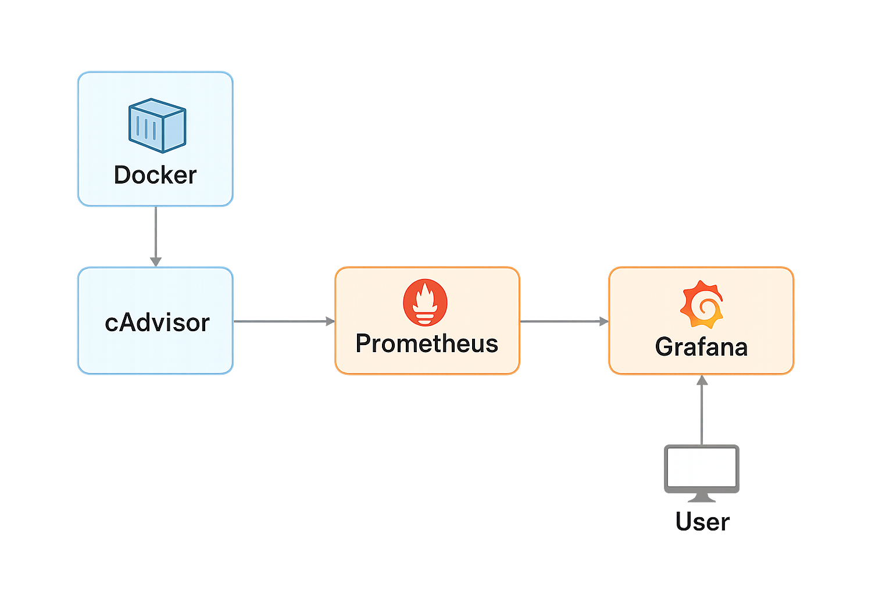

# Dockervisor – Instant Observability Stack (Grafana + Prometheus + Loki)

**Dockervisor** is a ready-to-use observability stack powered by **Grafana, Prometheus, and Loki**, running entirely in Docker.  
With a single command, you can launch dashboards, metrics, and logs collection for any service — no Kubernetes required.

---

## Features

- **One-command setup** with `docker-compose up -d`.
- **Full observability stack**: Grafana (dashboards), Prometheus (metrics), Loki (logs).
- **Preconfigured dashboards** for quick insights.
- **Demo service included** to generate metrics and logs out of the box.
- **Easily extensible**: add your own services, dashboards, and exporters.

---

## Project Structure

```
Dockervisor/
├── docker-compose.yml
├── grafana/
│   ├── dashboards/
│   │   └── sample-dashboard.json
│   └── provisioning/
│       ├── datasources/prometheus.yml
│       └── dashboards/dashboards.yml
├── prometheus/
│   └── prometheus.yml
├── loki/
│   └── config.yml
├── examples/
│   └── demo-service/
│       ├── Dockerfile
│       └── app.sh
├── docs/
│   ├── usage.md
│   └── architecture.png
├── README.md
└── LICENSE
```

---

## Architecture



---

## Quick Start

1. Clone the repository:

```bash
git clone https://github.com/celiaricogz/dockervisor.git
cd dockervisor
```

2. Launch the stack:

```bash
docker-compose up -d
```

3. Access the services:
- **Grafana**: [http://localhost:3000](http://localhost:3000) (user: `admin`, pass: `admin`)
- **Prometheus**: [http://localhost:9090](http://localhost:9090)
- **Loki API**: [http://localhost:3100](http://localhost:3100)

4. Explore the **Sample Dashboard** in Grafana — metrics, logs, and demo data will already be available.

---

## Demo Service

The stack includes a lightweight demo service (`examples/demo-service`) that generates:
- Random **Prometheus metrics** (counter `demo_requests_total`).
- Continuous **logs** (viewable via Loki).

This ensures you can see data flowing immediately without setting up your own apps.

---

## Extending Dockervisor

- **Add more services**: Just define them in `docker-compose.yml` and add scrape configs to `prometheus/prometheus.yml`.
- **Add dashboards**: Place `.json` files in `grafana/dashboards/` — they will auto-load.
- **Customize Grafana**: Modify provisioning files in `grafana/provisioning/`.

---

## License

Licensed under the **MIT License**.  
See [LICENSE](LICENSE) for details.

---

## Author

**Celia Rico Gutiérrez**  
DevOps Engineer — CI/CD automation, modularization, reproducible packaging  
[LinkedIn](https://www.linkedin.com/in/celiaricogutierrez)  
[Malt](https://www.malt.es/profile/celiaricogutierrez)
[UpWork](https://www.upwork.com/freelancers/~01898dfb872ff48b7a?mp_source=share)

---

_Last updated: July 2025_
